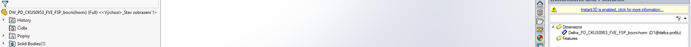
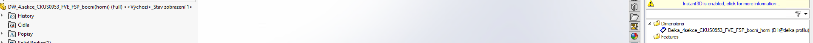
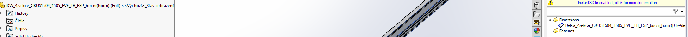
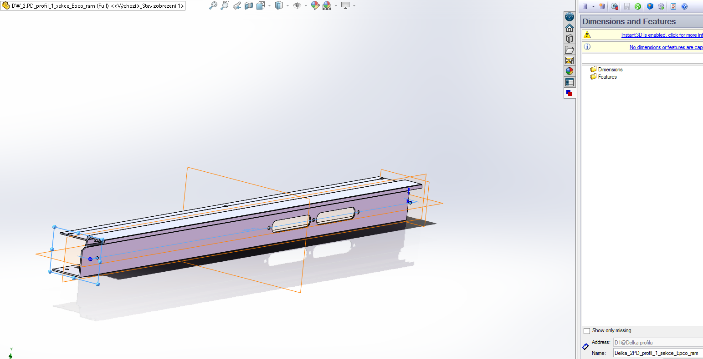

# Naming conventions
## Standard
- nahrada DW_ za dany rozmer
  - Delka_, Sirka_, Vyska_...
## Vyjimky
### Nelze pouzivat zavorky
- nahrazeno pomlckami
- zitra pravdepodobne predelat po domluve s michalem

- nahradit podtrzitkem pred

### Nelze pouzivat tecku
- vynechana
